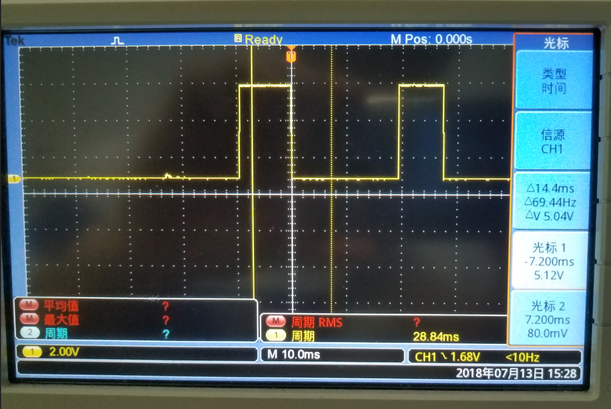
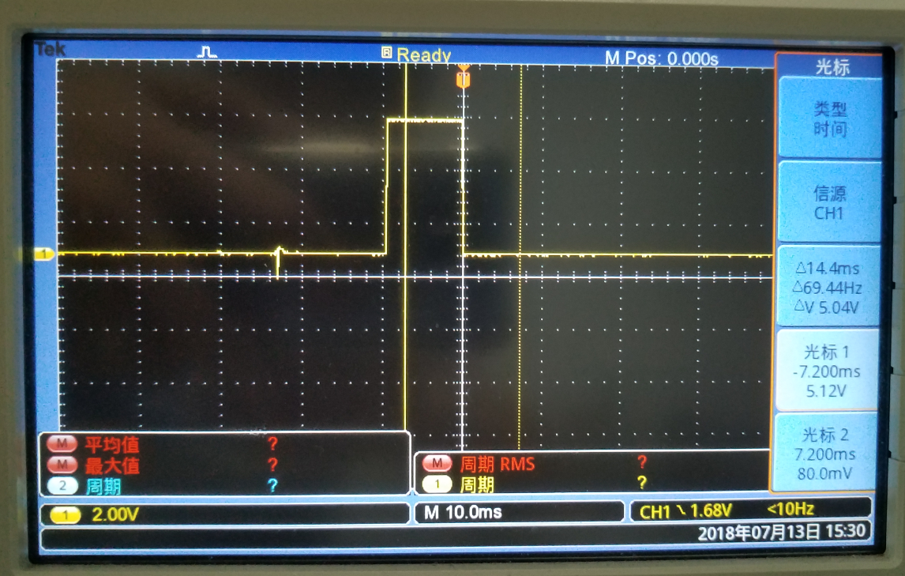
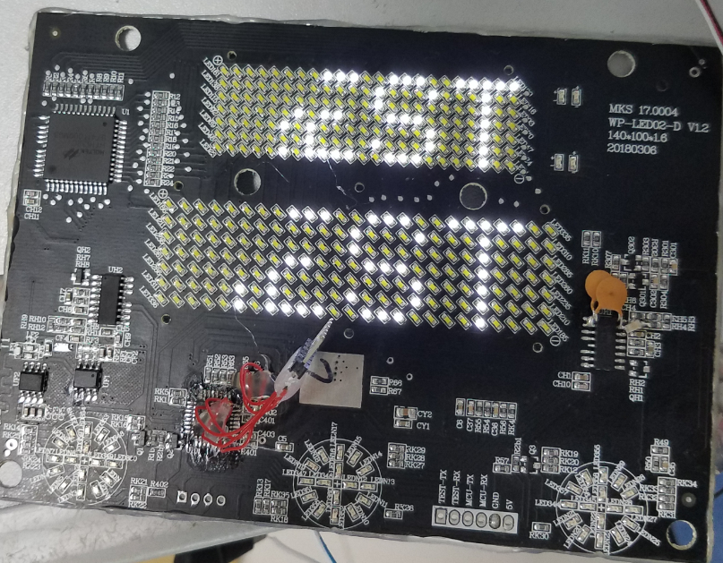
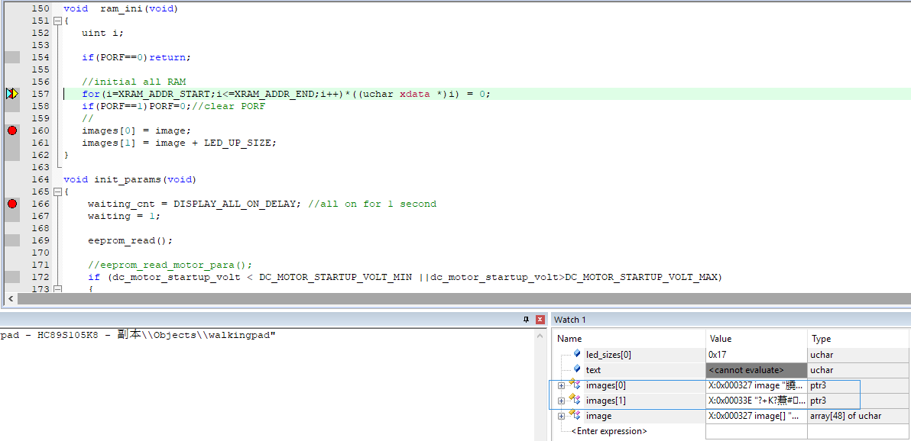
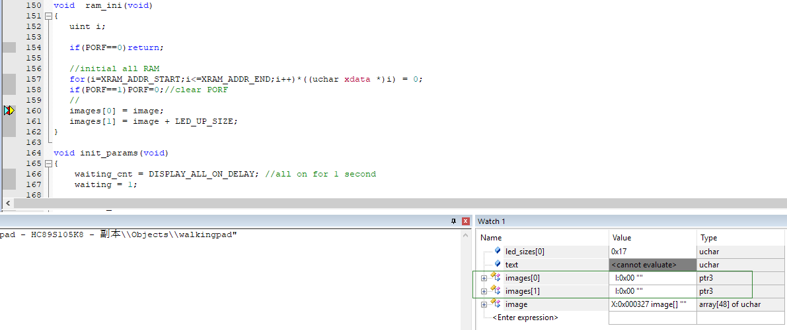
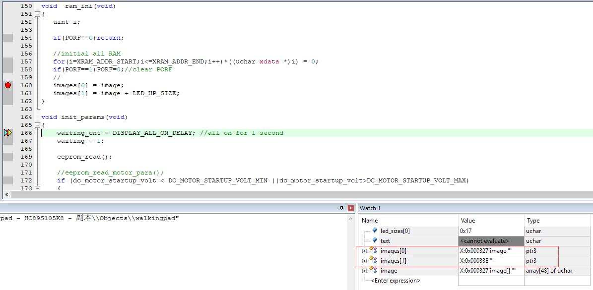

# 13号

## 1  
### 问题：变量初始化  
在将walingpad程序改成用HC89S105K8后，发现每次上电：蜂鸣器都会响一下，乱显示后，才显示正常。  
调试，发现：初始化后，运行主循环后，又一次跳到了初始化，而且查看复位标志，发现没有标志置位。  
  
进一步调试，发现是在运行disp_text函数中的：  

    memcpy(images[ic]+offset, ascii_2[c], 5);  
时，退出主循环，跳到初始化的。  
所以，将之改为：  

    for(i=0;i<5;i++)
    {
        images[ic][offset+i]=ascii_2[c][i];
    }  
此时，又发现，改后不会退出主循环再次进入初始化了，但是显示却不正确。  
  
   
继续调试，上电初始化经过ram_ini清RAM后，images（ uchar* images[2]= {image, image + LED_UP_SIZE};）的2个指针元素指向的地址就变成了I:0x00，而不是image的地址X:0x327和image + LED_UP_SIZE所表示的地址X:0x33E。  

    void  ram_ini(void)
    {
        uint i;
        if(PORF==0)return;
        //initial all RAM
        for(i=XRAM_ADDR_START;i<=XRAM_ADDR_END;i++)*((uchar xdata *)i) = 0;	
        if(PORF==1)PORF=0;//clear PORF
    }  
至此，发现了问题所在。  
### 解决  
#### 一种解决方法  
既然问题出在ram_ini后将images中存的地址数据清零了，那就不使用ram_ini，但是不清RAM又会，造成程序运行混乱。后来，发现在STARTUP.A51文件中，将：  

    XDATALEN        EQU     0
改成  

    XDATALEN        EQU     800H;HC89F105K8有2K XRAM  
在STARTUP中清XRAM，不会将images的2个指针元素指向的地址清零，且运行正常。  
#### 另一种解决方法  
不改变STARTUP.A51文件，既然经过ram_ini后，images的2个指针元素指向的地址被清零了，那就重新赋值。  
将ram_ini改为：   

    void  ram_ini(void)
    {
        uint i;
        if(PORF==0)return;
        //initial all RAM
        for(i=XRAM_ADDR_START;i<=XRAM_ADDR_END;i++)*((uchar xdata *)i) = 0;	
        if(PORF==1)PORF=0;//clear PORF
        //重新赋值
        images[0] = image;
        images[1] = image + LED_UP_SIZE;
    }  
经调试：  
   
  
  
images的2个指针元素重新指向了image的地址X:0x327和image + LED_UP_SIZE所表示的地址X:0x33E。  
并且，程序运行正确。  
### 总结  
现在想下来，这应该是uchar* images[2]的初始化顺序造成的。  

    uchar* images[] = {image, image + LED_UP_SIZE};  
在定义images的同时将其赋值初始化，这一过程应该是在STARTUP中完成的；而后经过ram_ini又被清零了。  
所以，需要重新赋值。  
其实可以  

    uchar* images[2];  
只定义images，在ini中在初始化赋值。  

    images[0] = image;
    images[1] = image + LED_UP_SIZE;  
这里，又想到了，原来将STM8的程序改用新唐和芯圣等用KEIL C51编译的单片机，遇到的问题：  
program_table在STM8中定义如下：  

    uchar const program_table[PROGRAM_SIZE][PROGRAM_DIV]   
在STM8中，const就是存放在code区域的。  
而在新唐和芯圣单片机中需要定义成：  

    uchar const code program_table[PROGRAM_SIZE][PROGRAM_DIV]   
要指定其在code区，program_table才会存储到CODE区域。  
不然，其就在RAM，经过ram_ini后，program_table的值都清零了；所以运行程式时，就出现每段速度都为0的问题。  
