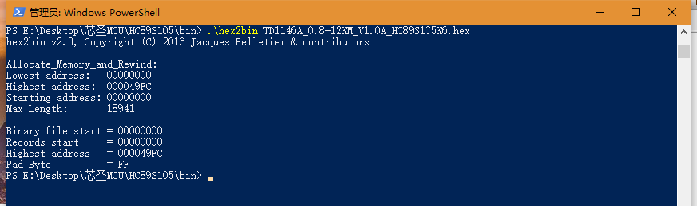
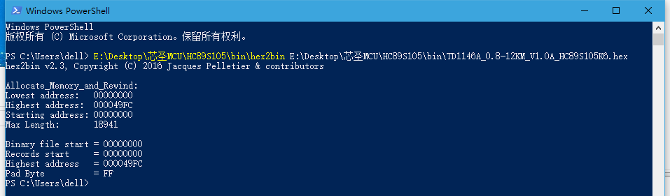

# 6号

## 1 KEIL C51将程序定位到从某个地址开始存放  
STARTUP.A51中  

    CSEG    AT      0F000H;0  ;原来从地址0开始，改为F000开始  
打开Options for Target——>BL51 Locate，把其中的Code Range改成0XF000-0XFFFF你想要的程序存放区域。  

## 2 使用hex2bin.exe将hex文件转换成bin文件  
例如：hex2bin.exe和hex文件都放在E:\Desktop\芯圣MCU\HC89S105\bin这个文件夹中。  
  
  
最后，在E:\Desktop\芯圣MCU\HC89S105\bin该文件夹中生成和hex文件同名的bin文件TD1146A_0.8-12KM_V1.0A_HC89S105K6.bin。  
